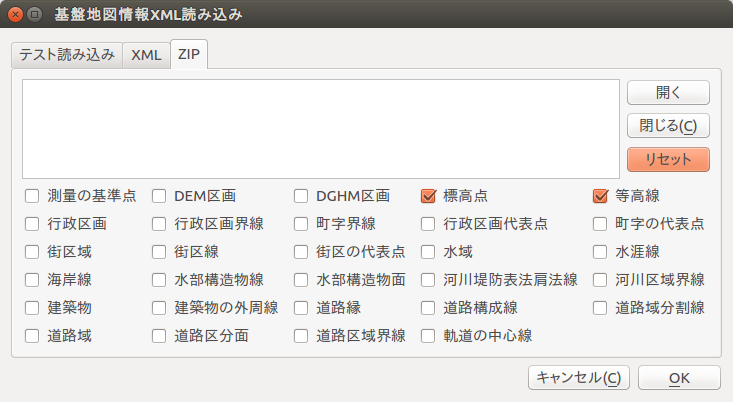

# 基盤地図情報XML読み込みプラグイン

基盤地図情報XMLファイルをQGISに直接取り込むプラグインです。

これまで基盤地図情報をQGISに読み込むには基盤地図情報ビューアを用いてESRI Shapefileに変換する必要がありましたが、このプラグインではXMLファイルかXMLを含むZIPファイルを渡すだけでQGIS上にジオメトリを展開します。

## 謝辞

* @muranamihdk - QGIS3対応

